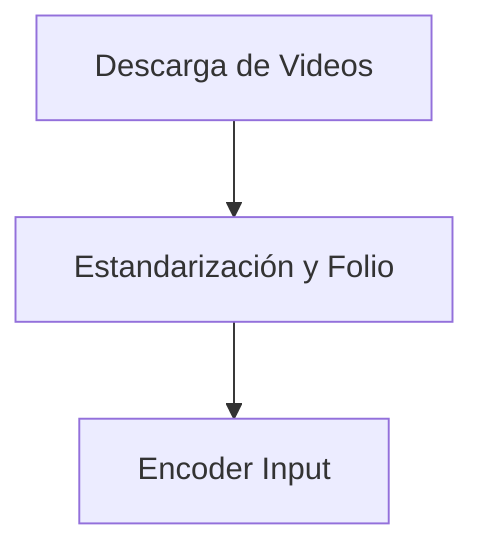
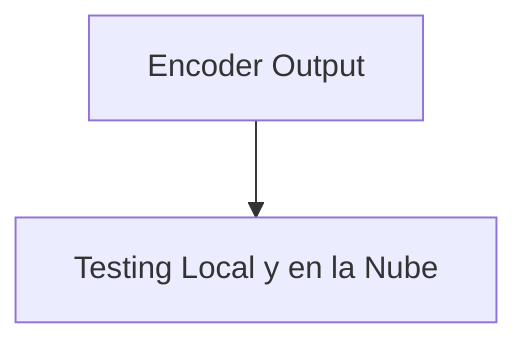
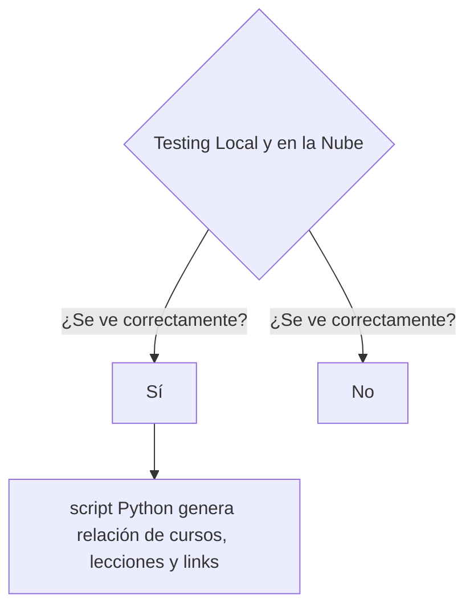
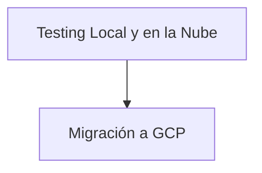
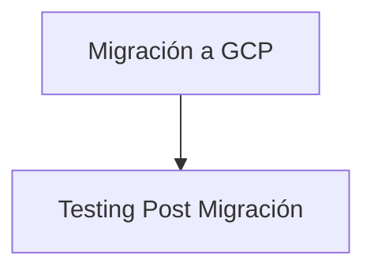
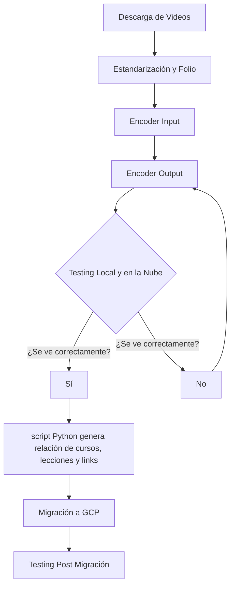

# encoder
Encoder de video con ffmpeg y manejo de archivos con python

# Documentación de Migración de Videos de Vimeo a Google Cloud Platform

## Introducción

Este documento describe el proceso de migración de videos desde Vimeo hacia Google Cloud Platform (GCP). El objetivo es almacenar los videos en un almacenamiento de GCP y garantizar su reproducción adecuada a través de una plataforma de streaming.

## Proceso de Migración

El proceso de migración consta de las siguientes etapas:

### 1. Descarga de Videos

Los videos alojados en Vimeo se descargan uno a uno y se respaldan en un disco duro externo.

### 2. Estandarización y Folio

Se define una nomenclatura uniforme para el nombre de los cursos (carpetas) y las lecciones. Esta estandarización se realiza manualmente.

### 3. Encoder Input

Los videos descargados se convierten al formato HLS utilizando un script de bash. Los archivos resultantes se organizan en carpetas por curso y lecciones, con diferentes resoluciones según las especificaciones.

### 4. Encoder Output
Los videos convertidos se almacenan en carpetas según la estructura de curso y lecciones, con diferentes formatos de resolución.

### 5. Testing Local y en la Nube
Se prueba la reproducción de los archivos HLS localmente utilizando VLC Player y a través de un CDN de Digital Ocean en la plataforma de streaming, mediante un proceso de rebuild en Netlify.

### 6. Generar la relación de cursos
Por medio de un script generamos un csv con una tabla de los cursos, lecciones y links:

|Curso|Lección|ruta master.m3u8|link server|
|-----|-------|----------------|-----------|
|eClass_Adios_al_sindrome_de_la_impostora_soy_capaz_y_lo_merezco|00-TS|hls\eClass_Adios_al_sindrome_de_la_impostora_soy_capaz_y_lo_merezco\00-TS\master.m3u8|http://example.com/master.m3u8|

### 7. Migración a GCP
Una vez que se confirma la reproducción adecuada de los videos, se procede a almacenarlos en Google Cloud Platform.

### 8. Testing Post Migración
Se realiza una prueba post migración reproduciendo los archivos HLS desde GCP a través de la plataforma de streaming utilizando un proceso de rebuild en Netlify.

### Conclusiones
El proceso de migración se completa satisfactoriamente con la verificación exitosa de la reproducción de videos desde Google Cloud Platform.
## Diagrama de flujo general

